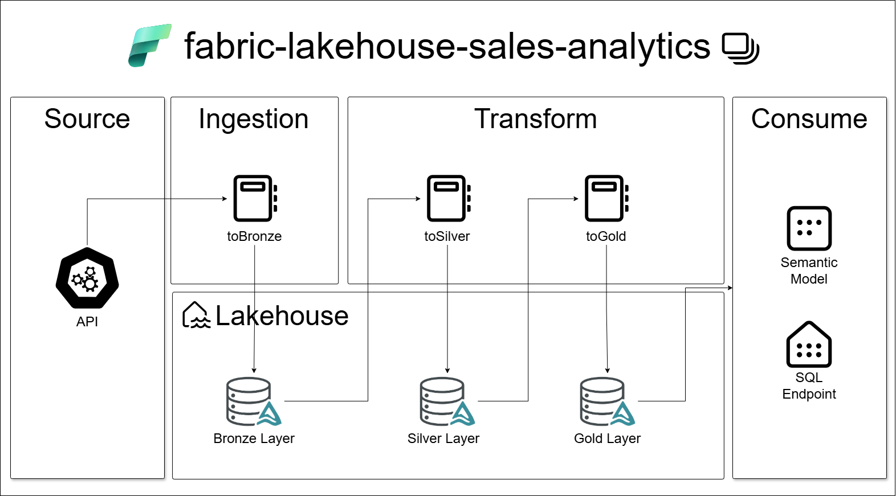
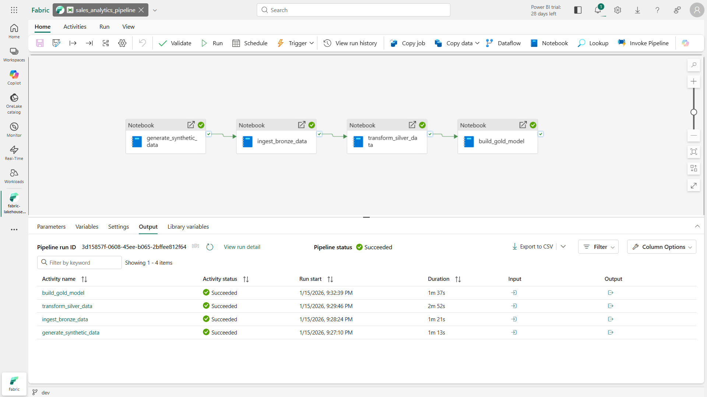

# Fabric Lakehouse Medallion Project

End-to-end implementation of a **Medallion Architecture (Bronze, Silver, Gold)** using **Microsoft Fabric Lakehouse**.  
This project was designed as a **portfolio-grade data engineering solution**, focusing on architectural clarity, best practices, and analytical modeling.

---

## 📌 Project Overview

This repository demonstrates how to design and implement a modern **Lakehouse-based analytical platform** using Microsoft Fabric, Spark, Delta Lake, and dimensional modeling.

The project simulates a commerce scenario, starting from raw transactional data ingestion and ending with an analytics-ready **Star Schema** optimized for BI tools such as Power BI.

---

## 🎯 Objectives

- Demonstrate a complete **Medallion Architecture** implementation
- Apply **data engineering best practices** using Microsoft Fabric
- Showcase **batch ingestion, transformation, and modeling pipelines**
- Implement **dimensional modeling (Kimball)** with SCD Type 2
- Provide clear documentation of **architectural decisions and trade-offs**

---

## 🏗️ Architecture Overview




### Core Components
- **Storage**: OneLake (Fabric Lakehouse)
- **Processing**: Apache Spark (PySpark)
- **Table Format**: Delta Lake
- **Orchestration**: Fabric Data Pipelines
- **Version Control**: Git

---

## 🧱 Medallion Layers

### 🥉 Bronze Layer — Raw Ingestion

**Purpose**
- Store raw transactional data with minimal transformation
- Preserve source structure and semantics
- Add technical metadata for lineage and auditing

**Key Characteristics**
- Source format: JSON
- Storage format: Delta Lake
- Metadata columns: ingestion timestamp, source system, batch_id
- Idempotent batch ingestion

---

### 🥈 Silver Layer — Transformation & Standardization

**Purpose**
- Normalize nested structures
- Apply data cleaning and validation rules
- Standardize data types and formats
- Prepare datasets for analytical modeling

**Key Transformations**
- Explode arrays and flatten structs
- Deduplication and sanity checks
- Type casting and precision alignment
- Derived analytical columns (dates, metrics)

---

### 🥇 Gold Layer — Analytical Modeling

**Purpose**
- Deliver analytics-ready datasets
- Optimize query performance
- Enable BI-friendly consumption

**Modeling Approach**
- Kimball **Star Schema**
- Append-only fact table
- Conformed dimensions
- **Slowly Changing Dimensions Type 2 (SCD2)**

**Gold Tables**
- `fact_purchases`
- `dim_customer` (SCD2)
- `dim_product` (SCD2)
- `dim_date` (immutable, YYYYMMDD key)

---

## 🔄 Orchestration

bronze_ingestion
silver_transformations
gold_modeling



A **Fabric Data Pipeline** orchestrates the execution of notebooks in the following order:

1. Synthetic dataset generation
2. Bronze ingestion
3. Silver transformation
4. Gold analytical modeling

> The pipeline is intentionally **manual**, as this project is focused on architecture demonstration rather than production operations.

---

## 📂 Repository Structure

```text
fabric-lakehouse-medallion/
├── architecture/
│   └── decisions.md
│
├── fabric/
│   ├── dataset_generator.Notebook
│   ├── bronze_ingestion.Notebook
│   ├── silver_transformation.Notebook
│   ├── gold_modeling.Notebook
│   ├── sales_analytics_pipeline.DataPipeline
│   └── lh_sales_analytics.Lakehouse
│
├── notes/
│   └── dev-notes.md
│
├── screenshots/
│
└── README.md
```

---

## 🧠 Architectural Decisions

Detailed architectural rationale and trade-offs are documented separately:

📄 **`architecture/decisions.md`**

This file explains:
- Why Medallion architecture was chosen
- Batch vs streaming decisions
- Modeling strategy and SCD approach
- Tooling choices and limitations

---

## 🧪 Data Characteristics

- **Data Type**: Synthetic commerce transactions
- **Granularity**: Item-level purchases
- **Volume**: Configurable (default: 1,000 purchases)
- **Usage**: Demonstration and portfolio purposes only

---

## ⚠️ Known Limitations

- Not production-grade (no CI/CD, alerting, or SLAs)
- Manual pipeline execution
- No streaming or CDC ingestion
- Basic data quality validations only
- Fabric-specific implementation

All limitations are **intentional** and aligned with the project scope.

---

## 🚀 Possible Enhancements

- Incremental ingestion and watermarking
- Streaming ingestion using Eventstream
- Data quality metrics and scorecards
- CI/CD with Fabric Deployment Pipelines
- Power BI semantic model and dashboards
- Security and access control policies

---

## 👤 Author

**Danillo Oliveira**  
Data Engineer | Lakehouse & Analytics Architecture  

This project is part of a professional portfolio demonstrating **end-to-end data engineering architecture using Microsoft Fabric**.

---

## 📜 Disclaimer

This project is for **educational and portfolio purposes only**.  
It does not represent a production deployment or real business data.